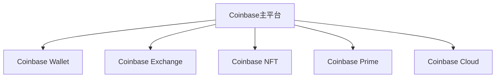

# Coinbase 与 Gemini 全面对比：如何选择加密货币交易平台？

## 平台背景对比
作为美国本土成长起来的两大加密货币交易平台，Coinbase 和 Gemini 的发展历程折射出加密行业不同阶段的特征。

👉 [了解领先平台的交易优势](https://bit.ly/okx_welcome)

**Coinbase**（2012年创立）：
- 创始人Brian Armstrong以支付创新为核心理念
- 用户规模突破1.16亿（截至2023年数据）
- 首家在纳斯达克上市的加密交易平台（2021年）

**Gemini**（2015年创立）：
- 由Winklevoss双胞胎兄弟创立（Facebook早期投资者）
- 注册用户超6000万
- 以合规性著称的"华尔街式"加密平台

| 维度        | Coinbase        | Gemini         |
|-------------|-----------------|----------------|
| 成立时间    | 2012年          | 2015年         |
| 注册用户量  | 1.16亿+         | 6000万+        |
| 上市状态    | 纳斯达克上市    | 私有公司       |
| 监管牌照    | 41州MTL牌照     | NYDFS牌照      |

## 费用结构深度解析
加密交易的核心成本不仅体现在表面费率，更需综合考虑交易深度、流动性等因素。

### 基础交易费用对比
```markdown
| 交易类型   | Coinbase标准账户 | Coinbase Pro | Gemini标准 | Gemini ActiveTrader |
|------------|------------------|--------------|------------|---------------------|
| Maker      | 0.50%            | 0.40%        | 0.35%      | 0.20%-0.35%         |
| Taker      | 0.50%            | 0.50%        | 0.60%      | 0.20%-0.35%         |
| 法币交易费 | $2.99-$3.99      | 无           | $0.99      | 无                  |
```

**费用优化策略**：
- Coinbase通过Coinbase Earn每月奖励3%-5%的$CLOUD代币
- Gemini提供阶梯式费率，月交易量超$100万可享0.1%费率
- 大额转账建议使用加密货币网络（如USDC链上转账免费）

## 安全体系对比
在加密行业频发的安全事件中，两大平台的安全架构值得深入分析。

### Coinbase安全架构
- 98%数字资产存储于冷钱包（物理隔离）
- 保险覆盖：与Lloyd's合作的$2.55亿数字资产保险
- 特色功能：智能合约审计系统实时监控异常交易

### Gemini安全架构
- 首创"零知识证明"技术验证资产储备
- 每月透明度报告公开冷热钱包比例
- 保险覆盖：$2亿美元冷存储保险+实时热存储保险

👉 [查看行业领先的安全解决方案](https://bit.ly/okx_welcome)

**安全事件记录**：
- Coinbase历史被攻击次数：2次（2014年、2016年，均全额赔付）
- Gemini历史被攻击次数：0次（截至2023年Q4）

## 产品生态对比
### Coinbase生态矩阵


### Gemini生态特色
- Gemini Dollar (GUSD)：首个获得NYDFS批准的稳定币
- Gemini Earn：机构级加密资产借贷服务
- Gemini Pay：商家加密支付解决方案

## 适合用户画像分析
### Coinbase适合人群
- 月交易频率低于10次的投资者
- 需要NFT交易功能的用户
- 希望使用信用卡即时购币的新手
- 美国本土用户（支持24种法币）

### Gemini适合人群
- 机构投资者（支持法币：美元、欧元、英镑）
- 高频交易者（API接口延迟<100ms）
- 重视合规性的专业投资者
- 需要稳定币发行解决方案的开发者

## 流动性深度分析
```markdown
| 交易对        | Coinbase日均交易量 | Gemini日均交易量 |
|---------------|--------------------|------------------|
| BTC/USD       | $25亿              | $8亿             |
| ETH/USD       | $15亿              | $5亿             |
| SOL/USD       | $3亿               | $1.2亿           |
| DOGE/USD      | $1.5亿             | $4000万          |
```

**流动性优化策略**：
- Coinbase采用混合流动性池技术
- Gemini与Wintermute等做市商深度合作
- 大额交易建议使用机构通道（最低价差可达0.05%）

## 创新功能对比
| 功能类别       | Coinbase创新点                  | Gemini创新点                 |
|----------------|---------------------------------|------------------------------|
| Web3入口       | 浏览器扩展钱包Dapp集成          | 支持MetaMask跨链交互         |
| 产品形态       | 首推"Learn & Earn"教育板块      | 推出加密借记卡Earn+          |
| 技术架构       | 开发开源区块链分析工具          | 部署零知识证明扩容方案       |
| 可持续发展     | 碳中和区块链认证系统            | 植树积分代币化计划           |

👉 [探索更多创新应用场景](https://bit.ly/okx_welcome)

## 常见问题解答（FAQ）

**Q1：Coinbase的信用卡手续费为何较高？**
A：Coinbase采用信用卡网络的加密货币交易通道，涉及三方面成本：银行手续费（2.5%-3.5%）、平台服务费（0.5%-1%）、即时结算成本。建议大额交易选择ACH银行转账方式。

**Q2：Gemini的监管优势体现在哪些方面？**
A：作为纽约州特许信托公司的Gemini，需遵守：
1. 每日资产审计制度
2. 100%存款准备金要求
3. 年度第三方安全审计
4. 实时交易监控系统

**Q3：如何判断自己适合哪个平台？**
A：可通过"5要素评估法"：
1. 交易频率（高频建议Gemini）
2. 持仓规模（超$5万建议Gemini保险方案）
3. 产品需求（NFT选Coinbase）
4. 技术能力（专业交易选Gemini ActiveTrader）
5. 合规要求（机构投资者首选Gemini）

**Q4：两家平台的税务报告有何差异？**
A：Coinbase提供：
- 自动化税务报表（1099-K）
- 跨年收益计算器
- 与TurboTax集成
Gemini提供：
- 完整的区块链交易记录
- 多重计价方法支持（FIFO/LIFO）
- 机构级审计报告

**Q5：移动应用体验差异？**
A：Coinbase App优势：
- 生物识别登录
- 即时市场数据推送
- NFT展示功能
Gemini App优势：
- 机构级行情分析
- 自定义API连接
- 跨平台资产看板

## 未来发展趋势预判
从行业格局演变来看，两大平台正朝着不同方向进化：
1. **Coinbase**：
   - 深化Web3基础设施布局（已收购NFT平台）
   - 扩展发展中国家市场（重点布局拉美、东南亚）
   - 开发零手续费交易模型

2. **Gemini**：
   - 打造机构级DeFi解决方案
   - 推进央行数字货币（CBDC）研究
   - 开发合规化衍生品交易

对于投资者而言，选择平台需关注三个核心指标：合规成本占比（建议不低于营收的15%）、冷存储比例（应超过90%）、API可用性（响应时间应低于200ms）。随着加密货币市场持续进化，平台间的差异化竞争将持续为用户创造更多选择空间。