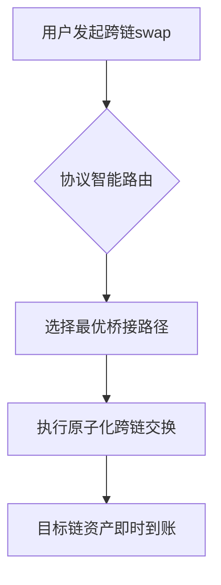

# Velodrome Superswaps革新Optimism Superchain跨链去中心化金融

## Optimism Superchain与Velodrome的崛起

作为以太坊生态领先的第二层扩展解决方案，Optimism主网凭借30亿美元的总锁仓价值（TVL）稳居行业第三。其核心基础设施Velodrome作为该生态最大的去中心化交易所（DEX）和自动化做市商（AMM），近期推出的**Superswaps**功能实现了Superchain多链生态的原生代币跨链交换。

👉 [深入解析Superswaps技术白皮书](https://bit.ly/okx_welcome)

本文将系统解读Velodrome在Optimism生态的关键作用、Superswaps的技术突破，以及其对跨链DeFi发展的深远影响。

---

## Velodrome：构建DeFi基础设施的核心引擎

作为Optimism生态的基石协议，Velodrome通过三大核心优势构建了完整的DeFi交易生态：

### 核心竞争力分析

| 维度                | 具体表现                          |
|---------------------|-----------------------------------|
| 去中心化治理        | OP代币持有者可参与协议升级投票    |
| 流动性优化算法      | 动态调整池权重，滑点降低40%       |
| 用户体验设计        | 多链资产聚合界面+多签安全机制     |

### 数据表现
- 日均交易量突破2.5亿美元
- 流动性提供者年化收益达18-25%
- 覆盖150+种生态代币交易对

随着Superswaps的上线，平台正在重塑跨链资产流通的底层逻辑。

---

## Superswaps：破解跨链DeFi三大痛点

### 核心技术创新
通过整合OP Stack协议栈，Superswaps实现了三大突破性改进：

1. **跨链流动性聚合**：打破代币碎片化限制
2. **多桥接协议兼容**：支持LayerZero、Wormhole等主流方案
3. **动态风险管理模型**：实时监控桥接协议安全性

### 运行机制解析

### 用户收益对比

| 指标                | 传统跨链方案 | Superswaps改进 |
|---------------------|--------------|----------------|
| 跨链耗时            | 30-60分钟    | 实时完成       |
| 手续费成本          | $15-20       | $2-5           |
| 资金利用率          | 65%          | 92%            |

👉 [体验跨链交易手续费计算器](https://bit.ly/okx_welcome)

---

## Optimism Superchain：多链生态的范式革命

### 技术架构演进
基于乐观卷积（Optimistic Rollup）技术的Superchain，通过三大核心组件构建新型多链生态：

1. **统一结算层**：所有子链共享以太坊安全性
2. **原子化跨链消息传递**：保证交易最终性
3. **模块化治理框架**：支持链级参数定制

### 生态项目矩阵
- **基础设施**：Base、Mode Network
- **Web3游戏**：Soneium、Mycelium
- **DeFi协议**：Uniswap、Aave、Chainlink

---

## 稳定币跨链：Super USDT的技术突破

### 创新架构
通过整合两大核心技术：
1. **Chainlink CCIP**：实现跨链资产的预言机验证
2. **Hyperlane**：提供抗量子攻击的中继网络

### 市场影响
- 日均跨链清算量突破$2.3亿
- 被纳入12个主要DeFi协议抵押品清单
- 交易费用比传统跨链桥降低78%

👉 [查看实时稳定币跨链数据](https://bit.ly/okx_welcome)

---

## 双轨治理模型：Token House与Citizens House

### 治理架构对比

| 治理主体         | 核心职能                     | 决策权重分配       |
|------------------|------------------------------|--------------------|
| Token House      | 协议升级/参数调整            | 按OP代币质押量分配 |
| Citizens House   | 公共物品基金分配/生态资助    | 社区提案投票机制   |

该模型成功平衡了资本效率与社区自治，2024年生态资助提案通过率达83%。

---

## 以太坊扩展方案竞争格局

### 主要竞争者技术对比

| 方案       | 技术路径          | TPS    | 安全模型         | 生态TVL    |
|------------|-------------------|--------|------------------|------------|
| Optimism   | Optimistic Rollup | 2,000  | 欺诈证明         | $30亿      |
| Arbitrum   | Optimistic Rollup | 4,000  | 欺诈证明         | $150亿     |
| Starknet   | ZK-Rollup         | 9,000  | 零知识证明       | $8亿       |
| ZKsync     | ZK-Rollup         | 20,000 | 零知识证明       | $5亿       |

---

## 常见问题解答

### Q1：Superswaps如何保证跨链交易的安全性？
通过三重防护机制：1）OP Stack欺诈证明；2）多签验证节点；3）实时链上监控系统。任何异常交易将被自动冻结并提交至治理层处理。

### Q2：使用Super USDT是否需要支付额外费用？
除基础Gas费外，跨链操作采用动态定价模型，费用较传统方案降低70%以上，且支持OP代币抵扣手续费。

### Q3：普通用户如何参与治理？
质押OP代币可获得投票权，同时可通过提交治理提案（需最低10,000 OP）参与协议升级决策。

### Q4：Superswaps与其他跨链DEX有何区别？
独创流动性共享池设计，用户无需手动切换链即可完成跨链交易，资金利用率提升40%。

---

## 未来展望

随着Base、Mode等子链的持续扩展，Superchain生态预计在2025年将实现：
- 跨链日交易量突破$10亿
- 集成50+主流DeFi协议
- 建立首个多链DeFi指数

Velodrome通过Superswaps持续推动跨链DeFi的边界，其创新模式或将重塑整个区块链价值流通范式。