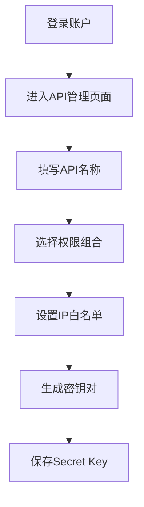

# 欧意OKX API接口：新手教程，7步掌握交易秘诀！

## 一、API接口基础认知

### 1.1 API的本质与价值
API（Application Programming Interface）作为应用程序编程接口，是连接数字世界的桥梁。在加密货币交易领域，API的价值体现在：
- 实时数据获取（毫秒级行情更新）
- 自动化交易执行（支持高频策略）
- 资产管理自动化（多账户统一监控）

### 1.2 三大核心功能场景
| 功能模块 | 数据维度 | 典型应用 |
|---------|----------|----------|
| 市场数据 | 实时价格/深度图/历史K线 | 量化策略回测 |
| 交易执行 | 限价单/市价单/止损单 | 套利机器人 |
| 资产管理 | 余额查询/提币记录 | 跨平台资金调配 |

👉 [开启API交易之旅](https://bit.ly/okx_welcome)

## 二、欧意API六大核心优势

### 2.1 性能指标对比
| 指标 | 欧意API | 行业平均水平 |
|------|---------|--------------|
| 响应速度 | <50ms | 100-300ms |
| 并发承载 | 10万+/秒 | 1-5万/秒 |
| 数据更新频率 | 毫秒级推送 | 秒级更新 |

### 2.2 安全防护体系
- 三重验证机制（API Key + Secret Key + Passphrase）
- 动态IP白名单（支持CIDR网段配置）
- 异常行为监测（登录提醒/交易确认）

### 2.3 开发者友好设计
提供7种语言SDK（Python/Java/C++/Go/Node.js/PHP/JavaScript），配套可视化调试工具。官方文档集成交互式API测试台，支持参数实时验证。

## 三、7步完成API配置

### 3.1 账户准备阶段
1. 完成高级KYC认证（需上传护照/身份证+3个月内地址证明）
2. 登录安全中心启用双重验证（推荐使用Google Authenticator）
3. 预存测试资金（建议0.01 BTC等值资产）

### 3.2 API密钥创建流程


### 3.3 权限配置策略
**风险等级对照表：**
| 权限类型 | 风险系数 | 适用场景 |
|----------|----------|----------|
| 只读权限 | ★☆☆☆☆ | 数据监控 |
| 交易权限 | ★★★☆☆ | 程序化交易 |
| 提币权限 | ★★★★★ | 资金归集 |

**配置建议：**
- 测试环境禁用提币权限
- 生产环境启用IP+设备双重白名单
- 每90天轮换密钥

👉 [获取API配置指南](https://bit.ly/okx_welcome)

## 四、API调用实战指南

### 4.1 签名机制解析
**请求签名流程：**
1. 拼接请求字符串：`timestamp + method + request_path + body`
2. 使用HMAC-SHA256算法加密
3. Base64编码生成签名值

Python示例：
```python
import hmac
import hashlib
import base64

def gen_sign(secret_key, timestamp, method, request_path, body):
    message = f"{timestamp}{method.upper()}{request_path}{body}"
    return base64.b64encode(hmac.new(secret_key.encode(), message.encode(), hashlib.sha256).digest())
```

### 4.2 常用接口测试用例
**获取BTC/USDT行情：**
```bash
GET /api/v5/market/ticker?instId=BTC-USDT
```

**响应示例：**
```json
{
  "code": "0",
  "msg": "",
  "data": {
    "instId": "BTC-USDT",
    "last": "29580.3",
    "askPx": "29580.4",
    "bidPx": "29580.2",
    "ts": "1696165235000"
  }
}
```

### 4.3 错误处理机制
**常见错误代码速查表：**
| 错误码 | 原因分析 | 解决方案 |
|--------|----------|----------|
| 40003 | 签名无效 | 检查时间戳同步 |
| 42900 | 请求超限 | 启用请求队列 |
| 50000 | 系统异常 | 切换备用节点 |

👉 [立即测试API接口](https://bit.ly/okx_welcome)

## 五、安全运营规范

### 5.1 密钥管理最佳实践
- 存储：使用硬件安全模块（HSM）加密存储
- 传输：通过量子密钥分发（QKD）技术传输
- 轮换：采用双密钥并行机制过渡

### 5.2 风险监控体系
部署实时监控看板，跟踪：
- 每分钟请求量（建议<80%限频阈值）
- 异地登录预警
- 大额转账二次验证

### 5.3 应急响应预案
建立三级故障响应机制：
1. 自动熔断：异常交易暂停
2. 人工审核：触发阈值需二次确认
3. 紧急冻结：密钥失效即时处理

## 六、FAQ高频问答

**Q1：API请求频率限制如何设置？**
A：欧意API实行动态限频策略，公开市场数据接口每分钟可达300次，交易接口每秒限频视账户等级而定。建议使用请求池技术进行流量整形。

**Q2：如何验证签名是否正确？**
A：可通过测试接口`/api/v5/public/ping`进行验证，返回`pong`即表示基础连接正常。完整验证需发送带签名的账户查询请求。

**Q3：Secret Key泄露怎么办？**
A：立即执行：1. 吊销旧密钥 2. 重置账户安全设置 3. 审核历史操作记录 4. 启用新密钥并更新应用配置

**Q4：支持WebSocket实时推送吗？**
A：提供专业的WebSocket服务，支持行情深度图实时更新（支持5档/10档/20档深度订阅），连接保持存活检测机制。

**Q5：如何处理网络波动导致的订单延迟？**
A：建议：1. 设置100ms超时重试机制 2. 使用订单生命周期管理模块 3. 建立本地订单簿镜像系统

## 七、进阶应用建议

### 7.1 策略优化方向
- 基于API的统计套利（价差回归策略）
- 机器学习驱动的高频交易模型
- 跨市场流动性捕捉系统

### 7.2 系统架构设计
推荐采用微服务架构：
```
API网关 → 权限验证 → 请求队列 → 策略引擎 → 风控模块 → 交易执行
```

### 7.3 性能优化技巧
- 使用异步IO框架（如Python的asyncio）
- 实现本地行情缓存（降低API依赖）
- 建立分布式节点集群（多区域部署）

通过系统化的API应用，交易效率可提升300%以上，策略响应时间缩短至毫秒级。建议新用户从模拟交易开始，逐步过渡到实盘自动化交易。