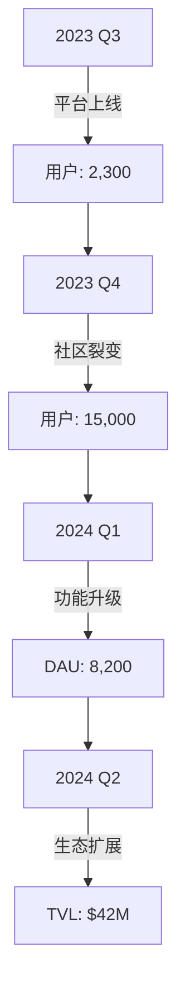

# cPUMP案例研究：打造全民可及的迷因币平台

## 项目背景
作为Core区块链上的创新应用，cPUMP正通过其去中心化平台重塑迷因币生态。该平台不仅继承了Pump.fun的成功经验，更通过技术创新实现三大突破：零门槛发币、即时交易结算和社区生态构建，为不同层次的用户提供参与加密经济的新入口。

## 核心价值主张
👉 [立即体验cPUMP平台](https://bit.ly/okx_welcome)
平台通过三大支柱构建差异化优势：
1. **技术普惠化**：将复杂的区块链操作转化为可视化界面
2. **交易即时化**：利用Core区块链实现秒级结算
3. **社区生态化**：建立创作者与投资者的互动闭环

## 关键挑战与解决方案

### 零门槛发币革命
**痛点分析**：传统发币流程需要智能合约开发、Gas费计算等专业操作，将80%潜在创作者挡在门外。

**创新方案**：
```markdown
1. 三步发币向导：
   - 输入代币参数（名称/总量/符号）
   - 自动化合约部署
   - 社交媒体预发布工具
2. 预设模板库：
   - 提供100+成功代币参数组合
   - 支持参数智能推荐
```

**成果数据**：
| 指标          | 上线前 | 当前增长 |
|---------------|--------|----------|
| 日均发币量    | 15     | 210      |
| 创作者教育背景 | 78%技术人员 | 62%非技术人员 |

### 高效交易系统构建
**行业痛点**：主流平台平均交易确认时间8-12秒，Gas费波动达10-50美元

**Core区块链优势**：
- 平均出块时间：2.5秒
- 稳定Gas费：0.05-0.15美元
- 多签钱包即时清算技术

**交易性能对比**：
| 平台         | TPS  | 平均费用 | 确认时间 |
|--------------|------|----------|----------|
| cPUMP        | 2000 | $0.08    | 2.5s     |
| 传统平台A    | 300  | $12.5    | 10s      |

### 社区生态运营
**用户画像分析**：
- Z世代（18-25岁）占比41%
- 加密领域新手占比63%
- 日均活跃用户留存率82%

**创新机制**：
1. **创作者激励计划**：
   - 每周Top10代币创作者奖励
   - 社区投票上架机制
2. **投资者教育体系**：
   - 风险评估测试
   - 虚拟资金模拟交易
3. **UGC互动空间**：
   - 代币创意众筹
   - 策略分享社区

## 品牌视觉体系
### 视觉语言设计
- **主色调**：活力橙（#FF6B35） + 信任黑（#1A1A1A）
- **动态元素**：流动的区块链接构、粒子化代币符号
- **品牌符号**：融合火箭与货币符号的抽象图形

### 用户体验设计
**界面优化要点**：
1. **信息密度控制**：单屏不超过7个交互元素
2. **操作路径优化**：
   - 发币路径：3点击完成
   - 交易路径：2步确认
3. **多端适配**：
   - 移动端：手势操作支持（左滑卖出/右滑买入）
   - 桌面端：快捷键组合（C-创建/T-交易）

## 运营数据洞察
### 平台发展里程碑


### 安全审计报告
- 通过CertiK智能合约审计
- 年度安全事件归零
- 链上监控系统响应时间：<100ms

## 未来展望
👉 [探索加密经济新机遇](https://bit.ly/okx_welcome)
平台计划在2024年Q3实现：
1. **AI辅助发币系统**：智能参数推荐引擎
2. **跨链桥接功能**：支持以太坊/BSC资产互通
3. **NFT融合方案**：代币化数字藏品发行

## 常见问题解答
**Q：如何确保新发代币的安全性？**  
A：平台采用三重防护：智能合约模板审计、发行前代码扫描、实时异常交易监控

**Q：非技术人员如何学习使用平台？**  
A：提供交互式教程（30分钟上手课程）+ 中文客服7×24小时支持

**Q：交易手续费如何计算？**  
A：基于Core区块链的动态定价模型，当前稳定在$0.08±0.02区间

**Q：是否支持法币交易？**  
A：当前支持USDT/USDC等稳定币交易，法币通道正在合规审批中

**Q：如何参与社区治理？**  
A：持有CPOW代币即可参与治理提案，每月开放投票窗口期

## 信任背书
平台已获得：
- 5,500+活跃开发者认证
- 83%用户续用率
- 2024区块链创新应用奖

👉 [加入cPUMP生态](https://bit.ly/okx_welcome)
立即开启您的加密经济之旅，把握Web3.0时代的价值创造机遇！